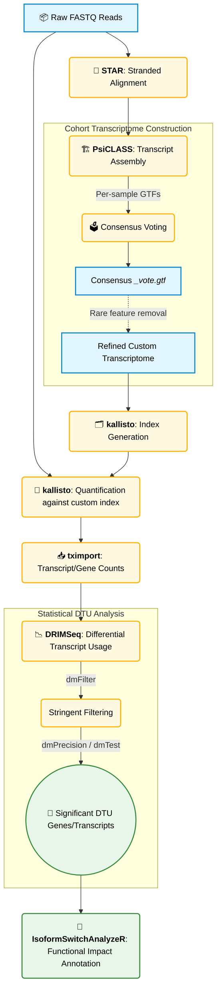

# 🧬 Isoform Discovery & Analysis Pipeline

This pipeline is designed to perform comprehensive **Differential Transcript Usage (DTU)** and novel isoform discovery. Unlike standard gene-level workflows, this pipeline reconstructs a custom, cohort-specific transcriptome from your data before quantifying it. This allows the discovery of unannotated splice variants and condition-specific transcript structures.

### 🐍 How It Works
The pipeline leverages *Snakemake* to orchestrate a precise chain of tools. It starts by generating stranded alignments, performs a multi-sample transcript assembly to build a consensus transcriptome, quantifies reads against this custom reference, and ultimately tests for differential usage of isoforms between biological conditions.

---

## 🚀 Pipeline at a Glance



---

<details open>
<summary><b>📖 Detailed Pipeline Methodology</b></summary>
<br>

### 1. Host Alignment (`STAR`)
`PsiCLASS` requires high-quality, stranded alignments to discover novel splice junctions. `STAR` is executed with the `--outSAMstrandField intronMotif` flag to ensure strand tags (`XS` tags) are explicitly included in the BAM files.

### 2. Cohort Transcriptome Assembly (`PsiCLASS`)
Unlike reference-based quantification, this pipeline uses `PsiCLASS` to build a cohort-specific transcriptome.
* **Trusted Introns:** An external set of trusted introns (derived from GENCODE) is provided to stabilize the global splice graph and reduce the rate of sample-specific noise masquerading as "novel transcripts."
* **Strandedness (`--stranded`):** Carefully set based on library prep (e.g., `rf` for TruSeq Stranded mRNA/Total RNA).
* **Consensus Voting (`--vd`):** The pipeline runs in multi-sample mode. Across 100+ samples, the voting depth threshold is tightened (e.g., `--vd 2.0` or `3.0`) to aggressively suppress low-support fragments while retaining true recurring biology.
* **Subexon Classifier (`-c`):** Tuned for precision (e.g., `0.05`), controlling which subexons are included in the splice graph.
* **Intron Retention (`--sa`):** Adjusted to penalize spurious intron retention, which is a major source of noisy "novel isoforms."

### 3. Transcriptome Filtering
A custom cohort transcriptome often contains lowly expressed, sample-specific transcript models that will statistically penalize downstream testing. Before quantification, the consensus GTF (`_vote.gtf`) is filtered to retain "novel" junction chains only if they are present in a minimum number of samples (e.g., ≥5-10).

### 4. Quantification (`kallisto`)
The refined cohort GTF is merged with the reference genome to produce a custom transcript FASTA. A new `kallisto` index is generated, and all samples are ultra-rapidly quantified against this enhanced transcriptome.

### 5. Count Import (`tximport`)
To prepare the data for differential testing, `tximport` is used to convert Kallisto's transcript-level estimates into scaled counts, fulfilling the mathematical requirements of DTU frameworks.

### 6. Differential Transcript Usage (`DRIMSeq`)
`DRIMSeq` is employed to mathematically test whether the *relative proportion* (usage) of a transcript changes significantly between conditions.
* **Stringent Filtering (`dmFilter`):** The single most critical step for model stability. Isoforms must pass minimum count thresholds (`min_feature_expr = 10`) and proportional usage thresholds (`min_feature_prop = 0.10`) across a minimum number of replicates.
* **Testing (`dmTest`):** Executes both gene-level DTU tests (compositional shifts) and transcript-level tests (identifying the specific shifting transcripts).

### 7. Functional Impact (`IsoformSwitchAnalyzeR`)
Significant DTU genes and transcripts are passed to `IsoformSwitchAnalyzeR` to predict the biological consequence of the isoform switch (e.g., loss of a protein domain, induction of Nonsense-Mediated Decay, or signal peptide alterations).

</details>

---

## ⚠️ Single-End vs. Paired-End Considerations

While this workflow natively handles both Single-End (SE) and Paired-End (PE) data, Single-End libraries lack the fragment-level pairing information needed to easily disambiguate complex transcript structures.

When running SE data, the pipeline adjusts `PsiCLASS` parameters to be significantly more conservative:
* **Voting Depth (`--vd`):** Increased to `3.0 - 4.0` to require stronger coverage evidence.
* **Retained Intron Support (`--sa`):** Tightened to `1.5 - 2.0` to combat increased intron retention artifacts.
* **Subexon Classifier (`-c`):** Lowered to `0.03` for stricter precision.
* **Downstream QC:** Rare "novel" mono-exonic transcripts are treated with extreme skepticism unless validated by orthogonal data.

---

<details>
<summary><b>🛠️ Snakemake Configuration Example (PsiCLASS)</b></summary>
<br>

Below is a reference snippet demonstrating how `PsiCLASS` integrates directly into the Snakemake workflow, including automated generation of the trusted introns file from a reference GTF.

```python
rule trusted_introns:
    input:
        gtf=REF_GTF
    output:
        txt=PSI_DIR / "trusted_introns.txt"
    threads: 1
    shell:
        r"""
        # Extracts introns from exon chains grouped by transcript_id
        # Output format: chr  start  end  (1-based inclusive)
        python extract_introns.py {input.gtf} > {output.txt}
        """

rule psiclass:
    input:
        bamlist=PSI_DIR / "bamlist.txt",
        trusted=PSI_DIR / "trusted_introns.txt"
    output:
        vote=PSI_DIR / f"{PSI_PREFIX}_vote.gtf"
    threads: 16
    shell:
        r"""
        psiclass \
          --lb {input.bamlist} \
          -s {input.trusted} \
          --stranded rf \
          -p {threads} \
          -c 0.05 \
          --vd 2.0 \
          --sa 1.0 \
          --tssTesQuantile 0.5 \
          -o {params.outprefix}
        """
```
</details>

---

## ⚙️ Technical Requirements & Database Sizes

This module relies on computationally heavy alignment and multi-sample assembly steps. Below are the estimated sizes for the required databases and the recommended hardware configurations.

### Core Database Sizes & RAM Requirements

| Tool | Component / Database | Disk Space (Index/DB) | Expected RAM Usage |
| :--- | :--- | :--- | :--- |
| **`STAR`** | Host Genome (e.g., GRCh38/mm10) | ~27 GB | ~30 GB |
| **`PsiCLASS`** | Cohort Assembly (multi-sample) | Variable (BAMs) | ~16–32 GB |
| **`kallisto`** | Custom Transcriptome Index | < 2 GB | < 4 GB |

### General Tool Requirements
* **CPU / Compute**: The initial host alignment (`STAR`) and consensus assembly (`PsiCLASS`) are highly parallelizable. A compute node with **16–32+ CPU cores** is strongly recommended to keep execution times reasonable for large cohorts.
* **Lightweight Tools**: Utilities like `kallisto` and downstream R packages (`tximport`, `IsoformSwitchAnalyzeR`) are generally memory-efficient. However, running `DRIMSeq` on very large cohorts (100+ samples) with complex designs can be memory-intensive, requiring **8–16 GB RAM** for stability.
* **Storage**: In addition to reference indexes, ensure you have sufficient temporary disk space to store all sample `.bam` alignments simultaneously, as `PsiCLASS` requires concurrent access to all BAMs during the consensus voting stage.
