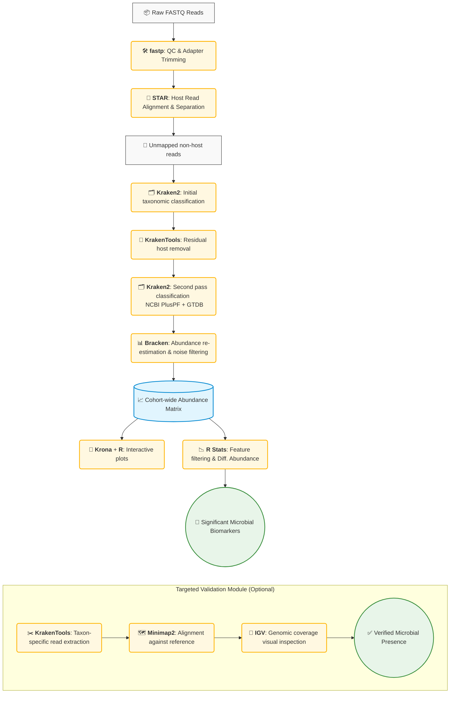

# 🦠 Metagenomics Pipeline Overview

The primary objective of this pipeline is to discover and quantify microbial populations (such as bacteria, viruses, and fungi) present in biological samples, leveraging data that is already generated during standard sequencing protocols.

While sequencing experiments (like RNA-seq) are often designed to study a host organism (e.g., Human or Mouse), they simultaneously capture genetic material from the microbiome. By efficiently recycling the "leftover" unmapped sequencing reads that would otherwise be discarded, this pipeline provides a significant dual-benefit: investigating the host's transcriptomic profile while simultaneously obtaining a comprehensive snapshot of the sample's microbiome.

---
## 🚀 Pipeline at a Glance

---

## 🧬 Taxonomic Classification Strategy

When performing Kraken, to ensure the highest accuracy and mitigate the risk of false positives, the pipeline includes two distinct databases:

* **NCBI PlusPF Database**: A broad, standard database covering bacteria, archaea, viruses, and fungi. *Limitation:* Due to the over-representation of clinical isolates in public repositories, it is prone to erroneously assigning novel environmental sequences to well-studied taxa (database bias).
* **GTDB (Genome Taxonomy Database)**: A highly standardized database focused specifically on high-quality bacterial and archaeal genomes. *Limitation:* It relies exclusively on prokaryotic phylogenies, making it inherently blind to viruses and fungi.

---

<b>📖 Click to read detailed pipeline step descriptions</b>

 

**1. Quality Control (`fastp`)** 
Before biological analysis, the raw sequencing data undergoes rigorous quality control. *fastp* ensures the removal of low-quality bases and technical artifacts (such as adapter sequences).

**2. Host Read Separation (`STAR`)** 
*STAR* aligns all sequences against the respective host reference genome. Any read that successfully maps to the host is separated for standard transcriptomic analysis. What remains is a collection of unmapped reads.

**3. Initial Taxonomic Classification (`Kraken2`)** 
The remaining unmapped sequences are queried against the NCBI PlusPF database for an initial broad classification.

**4. Secondary Host Depletion (`KrakenTools`)** 
Despite the initial alignment step, some residual host reads can escape detection. Any sequence classified as *Homo sapiens* (TaxID: 9606) in the first pass is explicitly flagged and computationally extracted to prevent contamination.

**5. Second-Pass Classification (`Kraken2`)** 
Kraken2 is executed a second time on this strictly depleted dataset. This rigorous two-pass approach ensures that the final microbial profile is not skewed by human sequences.

**6. Abundance Estimation & Noise Filtering (`Bracken`)** 
Because Kraken2 is a conservative classifier that assigns ambiguous reads to higher taxonomic ranks (like genus or family), *Bracken* employs a Bayesian probabilistic model to mathematically redistribute these reads down to the species level. Concurrently, it applies essential noise filtering by discarding taxa that appear below a defined abundance threshold.

**7. Data Aggregation & Differential Abundance (Custom Scripts + R)** 
The pipeline aggregates the data across the entire cohort into a unified matrix. It applies stringent prevalence filters to remove sparse taxa, and performs statistical testing (e.g., Wilcoxon rank-sum test) to pinpoint significantly enriched or depleted microbial populations.

**8. Interactive Visualizations (`Krona` & `R/ggplot2`)** 
*Krona* renders dynamic, multi-layered pie charts that allow researchers to visually explore the microbiome. Customized *R/ggplot2* scripts generate graphics to summarize the cohort.

---

## ⚙️ Technical Requirements & Database Sizes

This pipeline relies on several memory-intensive steps, particularly during host alignment and taxonomic classification. Below are the estimated sizes for the required databases and the recommended hardware configurations.

### Core Database Sizes & RAM Requirements

| Tool | Component / Database | Disk Space (Index/DB) | Expected RAM Usage |
| :--- | :--- | :--- | :--- |
| **`STAR`** | Host Genome (e.g., GRCh38/mm10) | ~27 GB | ~30 GB |
| **`Kraken2`** | NCBI PlusPF Database | ~80–104 GB | ~65–85 GB |
| **`Kraken2`** | GTDB v226 Database | ~650 GB | ~650 GB |
| **`Kraken2`** | NCBI core_nt Database (Optional) | ~316 GB | ~320 GB |
| **`MetaPhlAn4`** | `mpa_vJun23_CHOCOPhlAnSGB` (Optional)| ~19 GB | ~19 GB |
| **`Kaiju`** | `nr_euk` Database (Optional) | ~40–50 GB | ~45 GB |
| **`Minimap2`** | Microbial Reference (per species) | < 1 GB | ~4 GB |

### General Tool Requirements
* **`fastp`, `KrakenTools`, `Bracken`, `Krona`, `R Stats`**: These utilities are relatively lightweight and will run comfortably on standard compute nodes with **8–16 GB RAM**.
* **Storage**: In addition to the database sizes listed above, ensure you have sufficient temporary disk space to handle intermediate fastq files (unmapped reads) and `.sam`/`.bam` alignments.
